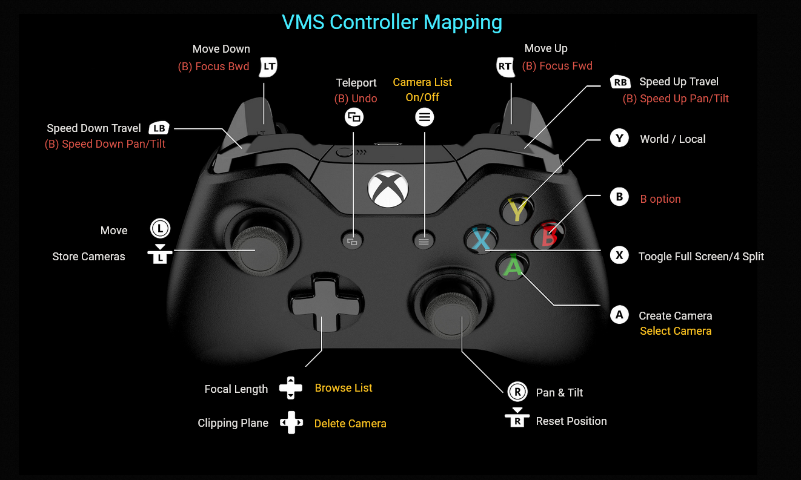
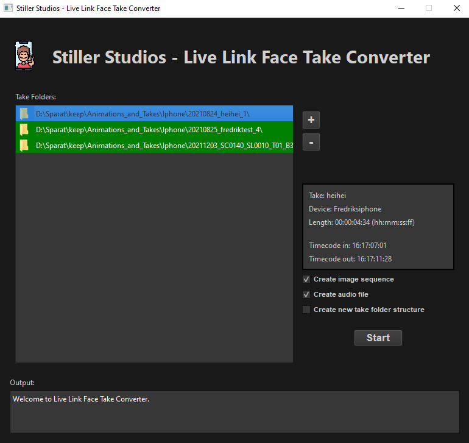
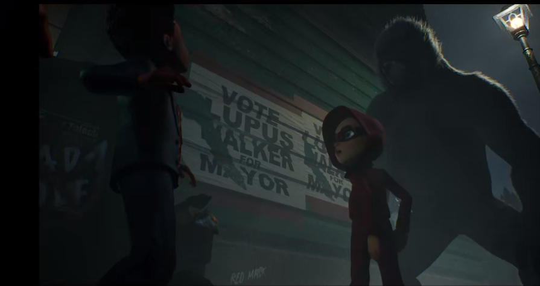
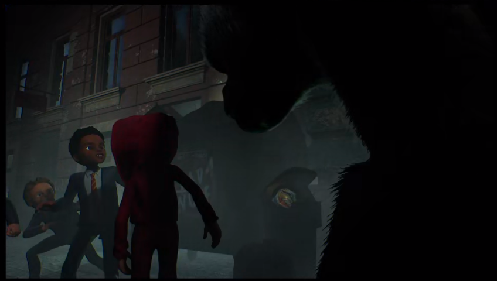
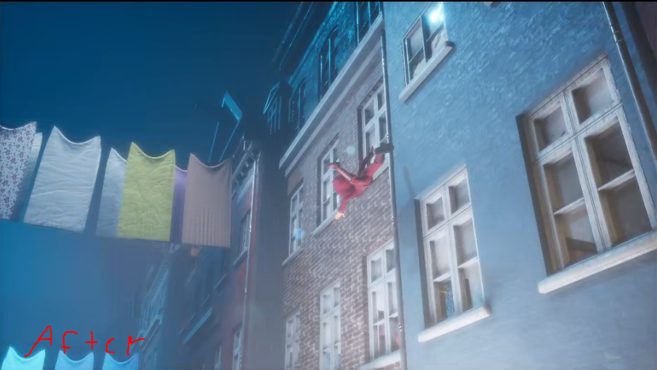

## Maya Toolkit
Includes a wide variety of tools to make the job easier for artists and technical workers.  
I always try to make it as simple as possible and only add a single button per tool if possible.  

## Face & body mocap setup in Unreal Engine 

https://github.com/Dhanuir/myportfolio/assets/149911939/0cd28054-85f2-41d3-bef5-a011c1ab179f

## Unreal Engine Virtual Monitor Switch (VMS)
#### A tool used while shooting by the director, actors and others.

Use in production

https://github.com/Dhanuir/myportfolio/assets/149911939/66cd88a8-e98e-43e8-be1e-94805905b54e

Teleport and navigate the level using a gamepad or keyboard & mouse 

Create, edit and remove cameras, and view in foursplit mode 

Edit the foursplit sections 

Transfer cameras to a level sequence 

Gamepad layout 

## Cloth Simulation (Unreal Engine)

https://github.com/Dhanuir/myportfolio/assets/149911939/6ac107ff-568d-48c4-b8f7-bf60e5728684

## Web Mocap Previewer 
A tool to quickly preview mocap from a wide variety of devices.  

https://github.com/Dhanuir/myportfolio/assets/149911939/94e85e49-64f6-43aa-a5b3-6522e03d6f7f

## iPhone Face Mocap converter for Windows
Used to get the raw take from the iPhone and set it up for the 3D pipeline. 
- Changes takes from variable frame-rate to constant frame-rate and syncs the audio. 
- Adds burnt-in timecode. 
- Compress and transcode, and also creates an image sequence with an audio file. 

## Lighting in Unreal Engine

https://github.com/Dhanuir/myportfolio/assets/149911939/00e9268b-628b-48d3-a9fe-7dd4847ddd3c

