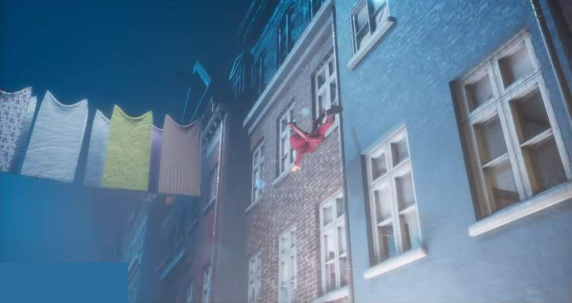

## Live Face & Body Mocap Setup in Unreal Engine 
Set up a character in Unreal Engine for real-time motion capture of body and face. This included rigging the character and creating the necessary blendshapes for real-time performance. 

https://github.com/Dhanuir/myportfolio/assets/149911939/0cd28054-85f2-41d3-bef5-a011c1ab179f

## Unreal Engine Virtual Monitor Switch (VMS)
A custom tool for Unreal Engine, used by directors, actors, and production teams during live shoots. It enables intuitive level navigation with a gamepad, camera placement/editing in a four-split screen mode, and sequence creation with a single click, significantly improving on-set production efficiency.  

Used in production

https://github.com/Dhanuir/myportfolio/assets/149911939/66cd88a8-e98e-43e8-be1e-94805905b54e

Teleport and navigate the level using a gamepad or keyboard & mouse 

Create, edit and remove cameras, and view in foursplit mode 

Full control over the viewing setup 

Gamepad layout 

## Cloth Simulation & Shading in Unreal Engine

## Maya Toolkit
Mocap tools to import and apply facial mocap data for animator refinement. 
Animation tools like controller mirroring and resetting, and converting Unreal Engine sequences to Maya. 
Rigging tools to export/import facial rig connections and create blendshapes. 
Export functionality to easily transfer complex characters and animations into Unreal Engine, reducing manual workload. 

Here's an example of one of the tools which imports a face mocap take and applies the data to the controllers which the animators can later fine-tune. 

https://github.com/Dhanuir/myportfolio/assets/149911939/2ddddefe-342b-428f-bd85-b3cbf15297a6

## Auto-Generate Face Controllers (WIP)
Users can either generate controllers for all blendshapes or select specific ones, allowing for intuitive control of facial expressions. Controller positions can also be adjusted after generation. 

## Web Mocap Previewer (React & Three.js)
A web-based mocap animation previewer built with React and Three.js, allowing teams to quickly review mocap animations across multiple devices via a browser. The tool supports uploading new characters, dynamically changing environments, lighting, and camera setups. It also includes functionality to place additional cameras in the scene, streamlining feedback and iteration cycles during animation reviews. 

https://github.com/Dhanuir/myportfolio/assets/149911939/94e85e49-64f6-43aa-a5b3-6522e03d6f7f

## iPhone Face Mocap converter for Windows & Mac
Used to get the raw take from the iPhone and set it up for the 3D pipeline. 
- Changes takes from variable to constant frame-rate and syncs the audio. 
- Adds burnt-in timecode. 
- Compress and transcode, and also creates an image sequence with an audio file. 

## Lighting for Promotional Content (Work in Progress)
Managed lighting for promotional content in Unreal Engine. The materials shown (one video and three images) represent work in progress, as they were created during the development phase and do not reflect the final result. 

https://github.com/Dhanuir/myportfolio/assets/149911939/00e9268b-628b-48d3-a9fe-7dd4847ddd3c

